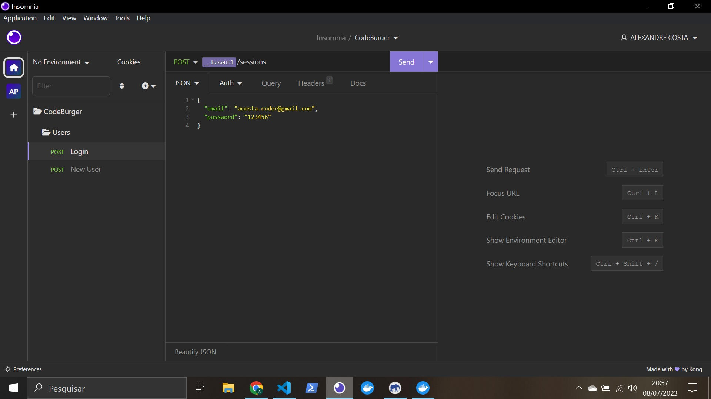

PASSO A PASSO projeto full-stack (use CODE CLUB BURGER como exemplar)

- instalo o "npm install -g yarn" no terminal do powershell

- crio a pasta da aplicação, abro com o VS

>INICIANDO BACK-END

- no terminal do vs, dou um "npm init -y"

- instalo o express com "yarn add express"

- crio a pasta src

- dentro de src, crio os arquivos: app.js, routes.js e server.js

- crio as estruturas de cada arquivo (olhar conteúdo de cada um)

- instalo nodemon "yarn add nodemon -D" no terminal do VS

- no package.json crio a dependência "dev" : "nodemon" situado em "scripts"

- em "main", troco o conteúdo por "main": "src/server.js"

- inicio o servidor com "yarn dev" no terminal do VS (se não rodar, de ctrl + c para parar de rodar tudo e volte a dar o comando)

- instalo a dependência sucrase "yarn add sucrase - D" (parar de rodar de novo para instalar)

- "yarn add sucrase-node src/server.js" no terminal do VS para rodar o server

- crio o arquivo "nodemon.json" na pasta RAIZ (não é no src, é na pasta antes dela ainda, na principal) e coloco o código que me permitirá rodar o nodemon com sucrase juntos
{
    "execMap":{
        "js": "node -r sucrase/register"
    }
}

- volto a rodar o yarn dev

- crio "debug": "nodemon --inspect" em "scripts" no package.json

- clico na aba de debug clico em "create a launch.json file", escolho Node, deleto a linha:
    "program": "${workspaceFolder}\\src\\server.js"
    e substituo para:
    "protocol": "inspector"
    também substituo conteúdo de request com:
    "request": "attach"
    Para debugar, basta pausar o server (ctrl+C) e usar "yarn debug" no terminal

- instale a extensão eslint (se já não estiver) na aba extenções
    Instalei a dependência "yarn add eslint -D" no terminal VS, se estiver rodando o sv, pare (ctrl+c) para poder instalar
    após instalado, digite no terminal: yarn eslint --init
    permita instalar packages extras se for nessessario com (y)
    após instalado, escolha a opção: To check syntax, find problems, and enforce code style
    proxima escolha: javascript modules (import/export)
    proxima escolha: None (porque estou no node)
    proxima escolha: No (não estou usando typescript)
    proxima escolha: aperto espaço na opçao Browser para destickar, e dou espaço em Node para deixar o tick e dou enter 
    proxima escolha: use a popular style guide
    proxima escolha: standard...
    proxima escolha: JavaScript
    proxima escolha: Yes
    proxima escolha: yarn 
    após instado, de um ctrl+shift+P e procure por "Preferences: Open user settings JSON"
    delete a linha "editor.defaultFormatter": "esbenp.prettier-vscode"
    e coloque o seguinte: 
      "[javascript]": {
        "editor.codeActionsOnSave": {
            "source.fixAll.eslint": true
        },
    },
    "[javascriptreact]": {
        "editor.codeActionsOnSave": {
            "source.fixAll.eslint": true
        },
    },
    salve agora estará pronto. toda vez que salvar os arquivos, já serão automaticamente formatados

- agora instalo o prettier, no terminal:
    "yarn add prettier eslint-config-prettier eslint-plugin-prettier -D"
    agora vou no arquivo .eslitrc.js e deixo o "extends" conforme o códig a seguir e adiciono o plugins prettier também:
    
    extends: [
        'standard', 
        'prettier'
    ],
    plugins: ['prettier'],

    em rules adiciono:

    rules: {
    camelcase: 'off',
    'prettier/prettier': ['error', { endOfLine: 'auto' }],
    },

    salvo.

- na pasta raiz, crio o arquivo .prettierrc
    adiciono o código:

    {
    "semi": false,
    "singleQuote": true
    }

- dentro da pasta src, crio a pasta app e dentro de app, crio as pastas controllers e models

- dentro da pasta src, crio a pasta config, dentro de config, crio o arquivo "database.js"

- dentro da pasta src, crio a pasta database, dentro de database crio o arquivo "index.js"
    também dentro da pasta database, crio outra pasta "migrations"

- instalo o docker, e quando estiver rodando normal dou continuidade.

- no terminal do vs, dou o comando:
docker run --name codeburguer-postgres -e POSTGRES_PASSWORD=postgres -p 5432:5432 -d postgres

onde:   --name (nome do projeto)
        -e POSTRES_PASSWORD=(senha desejada)
        -p 5432:5432 porta do pc (escolher) : porta postgres (padrão)

- dou um "docker ps" no terminal para mostrar as imagens que estão de pé

- caso tenha reiciado ou derrubado o docker, para deixar o container de pé novamente pode ser tanto pelo programa do docker, ou pelo terminal do vs.
    no terminal, digita: docker start (nome do container)
        ex: docker start codeburguer-postgres

- baixo o Postbird, que é uma interface gráfica do banco de dados

- entro no postbird e logo os dados, no caso dessa aplicação foi:
    Host: localhost
    Port: 5432
    Username: postgres
    Password: postgres
    >connect

- crio uma database (create database, nomeia (nesse caso foi codeburger) e cria)

- instalo o sequelize, no terminal "yarn add sequelize"

- instalo a biblioteca como dependencia no terminal "yarn add sequelize-cli -D"

- instalo no terminal: "yarn add pg pg-hstore"

- na pasta raiz, crio o arquivo ".sequelizerc"
    crio o conteúdo da pasta (vide arquivo)

- crio o conteúdo do database.js dentro da pasta config em src

- no terminal: "yarn sequelize migration:create --name=create-users"
    que é para criar a migration create-users, usando a biblioteca do sequelize-cli
    modifico o conteúdo dela (vide arquivo que foi criado dentro da pasta migration)

- no terminal, rodo:
    yarn sequelize db:migrate
    >só vai funcionar se o container do docker estiver rodando

- no postbird, atualizo as tabelas e vejo se chegou o conteúdo migrado

- crio o arquivo User.js dentro da pasta models, que está dentro da pasta app
    o arquivo é criado com letra maiúscula porque é uma classe

- crio o conteúdo desse arquivo (vide User.js)

- no arquivo "index.js" na pasta "migrations" crio a conexão do model com o banco de dados

- instalo uuid
    yarn add uuid

- crio o arquivo "UserController.js" na pasta controllers
    crio o conteúdo do arquivo

- crio a requisição New User no insomnia e testo criando um novo usuário
    
    o insomnia será usado para simular o front-end, até que ele fique pronto

- instalo a biblioteca Yup, que será usada para fazer a verificicação dos dados
    yarn add yup

- instalo a biblioteca bcrypt, que será usada para criptografar as senhas
    yarn add bcrypt

- importo e uso a biblioteca bcrypt em User.js na pasta models

- crio uma nova requisição de login no insomnia
    Nomeio de Login, será do tipo Post e enviará os dados pelo body usando Json
    na barra de endereço, coloco a baseUrl já salva e seguido de /sessions
    

- crio um novo controller, que será responsável por fazer o login do usuário
    na pasta controllers, crio o arquivo SessionController.js
    (vide códigos do arquivo)

- crio a rota /sessions em routes

- em User.js na pasta models, adiciono o código que fará a comparação da senha criptografada com a senha enviada pelo usuário. 

- crio uma nova tabela (em migrations), onde serão armazenados os dados dos produtos do site. 
    yarn sequelize migration:create --name=create-products
*obs: no código, foi usado uma sintaxe diferente em cada migration, deixei diferente para poder ter acesso as duas formas 

- rodo a migration, 
    yarn sequelize db:migrate
vejo no postbird se criou e prossigo

- crio o arquivo ProductController.js, na pasta controllers
    crio o conteúdo (códigos)

- crio a requisição de New Product no insomnia e já aproveito para organizar as pastas. Deixando login dentro da pasta session e crio a pasta Products, para colocar a requisição New Product
    New Product > tipo POST > JSON

- crio a rota em routes.js dessa requisição

- rodo a aplicação (yarn dev) e testo a rota com a requisição no insomnia

- vou trocar a requisição de JSON para "multpart form", pois vou precisar enviar imagens também

- instalo a biblioteca multer para auxiliar o upload de imagens, onde consiga enviar uma imagem no frontend e pegar no backend
    yarn add multer

- na pasta config, crio o arquivo multer.js 
    configuro o código (vide arquivo)
    
- crio a pasta "uploads" na pasta raiz

- importo o multer nas routes

- testo no a requisição no insomnia que deverá enviar um arquivo e as informações dele no body (o arquivo é salvo na pasta uploads)
    
- crio o arquivo Product.js dentro da pasta models
    crio o código do arquivo (vide arquivo)
    atualizo o código de ProductController.js
    inicializo o model (ou seja, conecto o model com a tabela do database)
    para isso, na pasta database, acesso o arquivo index.js e carrego Product junto com a importação (vide arquivo)
    testo enviando a requisição de products no insomnia
    crio a url (vide arquivo Product.js)
    crio um middleware no arquivo app.js
    e crio a rota do tipo get que vai listar todos os produtos (em routes.js)
    crio o método em ProductController.js
    crio a requisição GET no insomnia e testo se esta chegando todos os produtos cadastrados na rota New Product