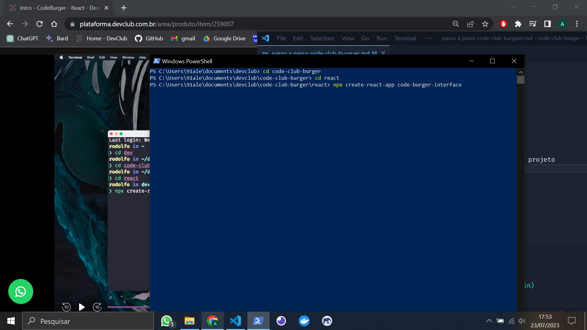

PASSO A PASSO projeto full-stack (use CODE CLUB BURGER como exemplar)

- instalo o "npm install -g yarn" no terminal do powershell

- crio a pasta da aplicação, abro com o VS

>INICIANDO BACK-END

- no terminal do vs, dou um "npm init -y"

- instalo o express com "yarn add express"

- crio a pasta src

- dentro de src, crio os arquivos: app.js, routes.js e server.js

- crio as estruturas de cada arquivo (olhar conteúdo de cada um)

- instalo nodemon "yarn add nodemon -D" no terminal do VS

- no package.json crio a dependência "dev" : "nodemon" situado em "scripts"

- em "main", troco o conteúdo por "main": "src/server.js"

- inicio o servidor com "yarn dev" no terminal do VS (se não rodar, de ctrl + c para parar de rodar tudo e volte a dar o comando)

- instalo a dependência sucrase "yarn add sucrase - D" (parar de rodar de novo para instalar)

- "yarn add sucrase-node src/server.js" no terminal do VS para rodar o server

- crio o arquivo "nodemon.json" na pasta RAIZ (não é no src, é na pasta antes dela ainda, na principal) e coloco o código que me permitirá rodar o nodemon com sucrase juntos
{
    "execMap":{
        "js": "node -r sucrase/register"
    }
}

- volto a rodar o yarn dev

- crio "debug": "nodemon --inspect" em "scripts" no package.json

- clico na aba de debug clico em "create a launch.json file", escolho Node, deleto a linha:
    "program": "${workspaceFolder}\\src\\server.js"
    e substituo para:
    "protocol": "inspector"
    também substituo conteúdo de request com:
    "request": "attach"
    Para debugar, basta pausar o server (ctrl+C) e usar "yarn debug" no terminal

- instale a extensão eslint (se já não estiver) na aba extenções
    Instalei a dependência "yarn add eslint -D" no terminal VS, se estiver rodando o sv, pare (ctrl+c) para poder instalar
    após instalado, digite no terminal: yarn eslint --init
    permita instalar packages extras se for nessessario com (y)
    após instalado, escolha a opção: To check syntax, find problems, and enforce code style
    proxima escolha: javascript modules (import/export)
    proxima escolha: None (porque estou no node)
    proxima escolha: No (não estou usando typescript)
    proxima escolha: aperto espaço na opçao Browser para destickar, e dou espaço em Node para deixar o tick e dou enter 
    proxima escolha: use a popular style guide
    proxima escolha: standard...
    proxima escolha: JavaScript
    proxima escolha: Yes
    proxima escolha: yarn 
    após instado, de um ctrl+shift+P e procure por "Preferences: Open user settings JSON"
    delete a linha "editor.defaultFormatter": "esbenp.prettier-vscode"
    e coloque o seguinte: 
      "[javascript]": {
        "editor.codeActionsOnSave": {
            "source.fixAll.eslint": true
        },
    },
    "[javascriptreact]": {
        "editor.codeActionsOnSave": {
            "source.fixAll.eslint": true
        },
    },
    salve agora estará pronto. toda vez que salvar os arquivos, já serão automaticamente formatados

- agora instalo o prettier, no terminal:
    "yarn add prettier eslint-config-prettier eslint-plugin-prettier -D"
    agora vou no arquivo .eslitrc.js e deixo o "extends" conforme o códig a seguir e adiciono o plugins prettier também:
    
    extends: [
        'standard', 
        'prettier'
    ],
    plugins: ['prettier'],

    em rules adiciono:

    rules: {
    camelcase: 'off',
    'prettier/prettier': ['error', { endOfLine: 'auto' }],
    },

    salvo.

- na pasta raiz, crio o arquivo .prettierrc
    adiciono o código:

    {
    "semi": false,
    "singleQuote": true
    }

- dentro da pasta src, crio a pasta app e dentro de app, crio as pastas controllers e models

- dentro da pasta src, crio a pasta config, dentro de config, crio o arquivo "database.js"

- dentro da pasta src, crio a pasta database, dentro de database crio o arquivo "index.js"
    também dentro da pasta database, crio outra pasta "migrations"

- instalo o docker, e quando estiver rodando normal dou continuidade.

- no terminal do vs, dou o comando:
docker run --name codeburguer-postgres -e POSTGRES_PASSWORD=postgres -p 5432:5432 -d postgres

onde:   --name (nome do projeto)
        -e POSTRES_PASSWORD=(senha desejada)
        -p 5432:5432 porta do pc (escolher) : porta postgres (padrão)

- dou um "docker ps" no terminal para mostrar as imagens que estão de pé

- caso tenha reiciado ou derrubado o docker, para deixar o container de pé novamente pode ser tanto pelo programa do docker, ou pelo terminal do vs.
    no terminal, digita: docker start (nome do container)
        ex: docker start codeburguer-postgres

- baixo o Postbird, que é uma interface gráfica do banco de dados

- entro no postbird e logo os dados, no caso dessa aplicação foi:
    Host: localhost
    Port: 5432
    Username: postgres
    Password: postgres
    connect

- crio uma database (create database, nomeia (nesse caso foi codeburger) e cria)

- instalo o sequelize, no terminal "yarn add sequelize"

- instalo a biblioteca como dependencia no terminal "yarn add sequelize-cli -D"

- instalo no terminal: "yarn add pg pg-hstore"

- na pasta raiz, crio o arquivo ".sequelizerc"
    crio o conteúdo da pasta (vide arquivo)

- crio o conteúdo do database.js dentro da pasta config em src

- no terminal: "yarn sequelize migration:create --name=create-users"
    que é para criar a migration create-users, usando a biblioteca do sequelize-cli
    modifico o conteúdo dela (vide arquivo que foi criado dentro da pasta migration)

- no terminal, rodo:
    yarn sequelize db:migrate
    só vai funcionar se o container do docker estiver rodando

- no postbird, atualizo as tabelas e vejo se chegou o conteúdo migrado

- crio o arquivo User.js dentro da pasta models, que está dentro da pasta app
    o arquivo é criado com letra maiúscula porque é uma classe

- crio o conteúdo desse arquivo (vide User.js)

- no arquivo "index.js" na pasta "migrations" crio a conexão do model com o banco de dados

- instalo uuid
    yarn add uuid

- crio o arquivo "UserController.js" na pasta controllers
    crio o conteúdo do arquivo

- crio a requisição New User no insomnia e testo criando um novo usuário
    
    o insomnia será usado para simular o front-end, até que ele fique pronto

- instalo a biblioteca Yup, que será usada para fazer a verificicação dos dados
    yarn add yup

- instalo a biblioteca bcrypt, que será usada para criptografar as senhas
    yarn add bcrypt

- importo e uso a biblioteca bcrypt em User.js na pasta models

- crio uma nova requisição de login no insomnia
    Nomeio de Login, será do tipo Post e enviará os dados pelo body usando Json
    na barra de endereço, coloco a baseUrl já salva e seguido de /sessions
    

- crio um novo controller, que será responsável por fazer o login do usuário
    na pasta controllers, crio o arquivo SessionController.js
    (vide códigos do arquivo)

- crio a rota /sessions em routes

- em User.js na pasta models, adiciono o código que fará a comparação da senha criptografada com a senha enviada pelo usuário. 

- crio uma nova tabela (em migrations), onde serão armazenados os dados dos produtos do site. 
    yarn sequelize migration:create --name=create-products
*obs: no código, foi usado uma sintaxe diferente em cada migration, deixei diferente para poder ter acesso as duas formas 

- rodo a migration, 
    yarn sequelize db:migrate
vejo no postbird se criou e prossigo

- crio o arquivo ProductController.js, na pasta controllers
    crio o conteúdo (códigos)

- crio a requisição de New Product no insomnia e já aproveito para organizar as pastas. Deixando login dentro da pasta session e crio a pasta Products, para colocar a requisição New Product
    New Product > tipo POST > JSON

- crio a rota em routes.js dessa requisição

- rodo a aplicação (yarn dev) e testo a rota com a requisição no insomnia

- vou trocar a requisição de JSON para "multpart form", pois vou precisar enviar imagens também

- instalo a biblioteca multer para auxiliar o upload de imagens, onde consiga enviar uma imagem no frontend e pegar no backend
    yarn add multer

- na pasta config, crio o arquivo multer.js 
    configuro o código (vide arquivo)
    
- crio a pasta "uploads" na pasta raiz

- importo o multer nas routes

- testo no a requisição no insomnia que deverá enviar um arquivo e as informações dele no body (o arquivo é salvo na pasta uploads)
    
- crio o arquivo Product.js dentro da pasta models
    crio o código do arquivo (vide arquivo)
    atualizo o código de "ProductController.js"
    inicializo o model (ou seja, conecto o model com a tabela do database)
    para isso, na pasta database, acesso o arquivo "index.js" e carrego Product junto com a importação (vide arquivo)
    testo enviando a requisição de products no insomnia
    crio a url (vide arquivo Product.js)
    crio um middleware no arquivo app.js
    e crio a rota do tipo get que vai listar todos os produtos (em routes.js)
    crio o método em "ProductController.js"
    crio a requisição GET no insomnia e testo se esta chegando todos os produtos cadastrados na rota New Product

- instalo a biblioteca JWT, que vai auxiliar na segurança 
    yarn add jsonwebtoken
    importo e uso em "SessionController.js"
    no segundo parametro do token jwt.sign recebe uma string, mas essa string precisa ser única, pois com essa string será gerado o token. 
    Então para aumentar a segurança, uso o MD5 hash generator (https://www.md5hashgenerator.com/)
    e gero um hash baseado na palavra codeburger

- crio o arquivo "auth.js" na pasta config para deixar o código mais clean e organizado.
    nesse arquivo coloco o segundo e terceiro parametros, sendo o hash criado pelo MD5 e tempo de expiração 
    e importo esse arquivo no "ProductController", onde estou usando o jwt

- em "ProductControler.js" coloco um console para verificar se o token está funcionando.
    
    testo o token gerado pela rota Login (post), copio esse token e uso na rota All Products (get)
    na sessão Auth, ao lado de body, escolho "Bearer token" e colo o token.
    
    
    estando tudo ok, deleto o console.log e continuo codando

- crio a pasta "middlewares" dentro da pasta "app"
    dentro da pasta, crio o arquivo "auth.js" e configuro esse middleware que fará a verificação se o usuário me enviou o token
    importo esse middleware nas rotas e uso
    crio a condição de aviso caso o usuário não envie o token (no middleware arquivo auth.js)

- inicio o relacionamento entre as tabelas de produtos e categoria 
     onde um produto terá uma categoria e uma categoria terá diversos produtos
     
- começo criando a tabela de categorias
    yarn sequelize migration:create --name=create-categories
    configuro ela (vide arquivo create categories, localizado em migrations)
    após pronto, rodo a migrate, criando a categoria no database
        yarn sequelize db:migrate

- no insomnia, crio a pasta Categories e a requisição "New Category" (post)
    

- agora crio o model e controller de categories
    na pasta models, crio o arquivo Category.js (faz a interface entre a aplicação e o banco de dados, responsavel por gravar e recuperar os dados)
    importo o Category no arquivo index.js na pasta database (vide arquivo)
    crio o arquivo CategoryController.js na pasta controllers (onde chega os dados e enviamos pra models)
    crio as rotas em routes.js (vide arquivo) (onde acessamos os controllers)

- no insomnia, crio uma nova rota para ver as categorias
    Show Categories, tipo GET
    
    Lembrando que para conseguir esse request, é necessário logar e copiar o token gerado, depois cola em Auth, escolhe bearer. É necessário tanto para criar uma nova category (rota POST) quanto para Show Categories (rota GET)

- crio uma migration para poder modificar tabelas, para caso eu crie algo que queira deletarno futuro.
    yarn sequelize migration:create --name=delete-category-column

    Nesse caso, eu queria deletar a coluna category, na tabela de products e substituir por category_id

- acesso a migration delete-category-column e crio o código que:
    em up: vai deletar a coluna category.
    em down: vai recriar a coluna (para caso de algo errado)

    rodo a migration no terminal
        yarn sequelize db:migrate

- crio outra migration para fazer o relacionamento entre as tabelas de category e products
    yarn sequelize migration:create --name=create-category-column
    crio o código e depois tudo pronto rodo a migration no terminal
        yarn sequelize db:migrate

- é muito importante que as migrations sejam criadas na ordem correta

- em seguida, instalo o mongodb no docker, ou seja, vou subir um container contendo o mongo no docker. 
    >atentar as duas opções abaixo
    docker run --name mongo -p 27017:27017 -d -t mongo
    OU
    docker run --name mongo -p 27017:27017 -d -t mongo:4.4 (use essa opçao se o processador nao suportar AVX)
    o container terá o nome mongo, 
    rodando na porta 27017 do meu computador, pois ele tem por padrão essa mesma rota
    vai rodar em segundo plano (-d)
    e escolho a imagem do mongo (-t mongo)

    já temos um container do postgres, mas usaremos o mongo também para aprendizado

- para testar se está corretamente instalado, acesso no meu navegador:
    localhost:27017
se estiver funcionando, deverá exibir a mensagem:
    "It looks like you are trying to access MongoDB over HTTP on the native driver port."

- instalo a biblioteca mongoose, que auxiliará no lugar do sequelize, que só funciona em bancos relacionais
    yarn add mongoose  

- faço a conexão da aplicação com o mongodb (na pasta database, no arquivo index.js)

- dentro da pasta "app", crio a pasta "schemas"
    dentro da pasta "schemas" crio o arquivo "Order.js"
    onde será montado o código dos pedidos

-  no insomnia crio meu modelo de Orders
     (print ainda estava sem endereço da rota)

- crio o arquivo "OrderController.js" na pasta controllers

- crio a rota de order em "routes.js"

- trabalho os arquivos (voltar a informar melhor depois)

- instalo (ou abro) o mongo Compass
    conecto e nele já estará o codebuger que o mongo criou automáticamente quando coloquei as infos de conexão do mongo no index.js

- trabalho em OrderController.js e routes.js para atualizar os status dos pedidos

- crio a requisição Show All Orders no insomnia 
    (No Body, com auth bearer, endereço baseUrl/orders)

- crio outra requisição Update Order
    tipo Put, com JSON, no endereço vai junto o ID que o mongo gera do pedido
    configuro a rota em OrderController.js e em routes.js

- inicio a validação de admin, para que somente o admin tenha acesso á certas áreas do site.
    como criar novo produto, nova categoria, atualizar pedido...
    para isso, mexo nos controllers onde tem necessidade de admin. Ex: OrderController, ProductController...

- testo no insomnia se consigo acessar com a conta logada que não tem o admin.
ex: criar um novo produto.
    crio uma outra conta com acesso de admin e testo

- crio uma nova migration que será responsavel por adicionar uma coluna (em products) que será relacionada aos produtos em promoção
    yarn sequelize migration:create --name=create-products-offer-column
    depois de criado, programo a migration e depois rodo com:
        yarn sequelize db:migrate
        
- atualizo Product.js para conter o offer
  atualizo ProductController.js

- crio o request update product em products no insomnia
    tipo PUT 
    lembrando que essa rota poderá trocar qualquer informação do produto, nesse caso, usamos para trocar o offer, mas poderia trocar nome, preço, foto do produto.. etc

    

- crio a rota put em routes.js

- crio outra migration que será responsável por atualizar as categories, afinal quero colocar fotos em cada category
    yarn sequelize migration:create --name=create-category-column
    configuro e rodo
        yarn sequelize db:migrate

    atualizo o Category.js
    atualizo o CategoryController.js
    atualizo routes.js
    atualizo app.js (onde crio uma rota para poder ver os uploads (arquivos))
    modifico a requisição de new category (post) para multiform, para poder enviar arquivo e testo

- vou criar o update de category
    inicio atualizando o código de CategoryController.js
    crio a rota put em routes.js
    crio a requisição PUT no insomnia e testo

> FRONT-END

     INTRO REACT 

- Começo criando o projeto react
    no powershell, procuro ou crio a pasta onde quero criar o projeto
    npx create-react-app code-burger-interface
         
        após criado, abro a pasta "cd  code-burger-interface"
        dou "code ." e inicio

- inicio deletando arquivos dentro de public
    logo192.png
    logo512.png
    manifest.json
    robots.txt

- atualizo o index.html
    

- em src deleto tudo, com exceção do index.js

- crio a pasta containers dentro da pasta src
    containers será onde ficarão todas as páginas

- dentro de containers, crio a pasta Login

- dentro da pasta Login, crio o arquivo index.js e o styles.js

- instalo eslint + prettier no react
    npm install eslint -D
    ou 
    yarn add eslint -D 

- após terminado, inicia o eslint para configurar
    npx eslint --init
    ou
    yarn eslint --init

    1: To check syntax, find problems, and enforce code style
    2: JavaScript modules (import/export)
    3: React
    4: No
    5: Browser
    6: Use a popular style guide
    7: Standard
    8: JSON
    9: Yes
    10: npm

    após instalado, dou um ctrl + shift + P
        > Preferences: open settings JSON
        
        
    e nesse JSON precisa ter essas linhas:
    
    "[javascript]" {
        "editor.codeActionsOnSave": {
            "source.fixAll.eslint": true
        },
    },
    "[javascriptreact]": {
        "editor.codeActionsOnSave": {
            "source.fixAll.eslint": true
        },
    }

- instalo a dependencia "eslint-plugin-import-helpers", que vai me ajudar com a organização das importações
    npm install eslint-plugin-import-helpers -D
    ou
    yarn add eslint-plugin-import-helpers -D

    adiciono as linhas no arquivo .eslintrc.json
    
    "plugins": [
        "react",
        "eslint-plugin-import-helpers"
    ],
    "rules": {
        "import-helpers/order-imports": [
            "warn",
            {
                "newlinesBetween": "always",
                "groups": [
                    "/^react/",
                    "module",
                    "/^@shared/",
                    [
                        "parent",
                        "sibling",
                        "index"
                    ]
                ],
                "alphabetize": {
                    "order": "asc",
                    "ignoreCase": true
                }
            }
        ]
    }

- instalo o plugin que auxilia na organização dos react hooks
    npm install eslint-plugin-react-hooks -D
    ou
    yarn add eslint-plugin-react-hooks -D

    em eslintrc.json, adiciono a linha em "extends"
    "plugin:react-hooks/recommended"

    em "plugins" adiciono:
    "react-hooks"

    em "rules", adiciono:
    "react-hooks/rules-of-hooks": "error", 
    "react-hooks/exhaustive-deps": "warn",

    

- instalo o prettier como dependencia de desenvolvimento
    npm install prettier eslint-config-prettier eslint-plugin-prettier -D
    ou
    yarn add prettier eslint-config-prettier eslint-plugin-prettier -D

    no arquivo .eslintrc.json:

    em "extends", adiciono:
    "plugin:prettier/recommended"

    em "plugins", adiciono:
    "prettier"

    em "rules", adiciono:
    "rules": {
        "no-unused-vars": "warn",
        "prettier/prettier": [
            "error",
            {
                "endOfLine": "auto",
                "trailingComma": "none",
                "singleQuote": true,
                "semi": false,
                "arrowParens": "avoid"
            }
        ],

        com o prettier e eslint configurados, volto a trabalhar o react.

        estilos globais com styled-components

- instalo o styled-components
    npm install styled-components
    ou
    yarn add styled-components

- na pasta "src", crio a pasta "styles"
    dentro de styles, crio o arquivo globalStyles.js

        Estilizando a tela de Login

- dentro da pasta "src", crio a pasta "assets"
    onde coloco as imagens que vou usar no front
    (para visualizar os arquivos svg, precisa ter instalado a extensão "preview svg")

- trabalho o index.js da pag Login (vide arquivo)
    é interessante visualizar tudo que vai precisar no site, monta e ja exporta

- trabalho o styles.js da pag login (vide arquivo)

        Formulário com React Hook Form

- para criar o formulário, vou usar a biblioteca "react-hook-form"
    https://react-hook-form.com/get-started

    npm install react-hook-form
    ou 
    yarn add react-hook-form

- nesse momento, a biblioteca será usada no arquivo "index.js" da página Login

        Validando o formulário de Login

- instalo a biblioteca que auxilia na validação
    npm install @hookform/resolvers yup
    ou
    yarn add @hookform/resolvers yup

- nesse momento, a biblioteca será usada no arquivo "index.js" da página Login
    também estilizo os erros no styles.js da página Login

    
        Conectando Front end e Back end

- começo rodando os containers de database no docker: postgres e mongo

- abro o back-end no VS

- certifico que a porta do backend não esteja rodando na porta 3000
    em src/server.js
    nesse caso, rodo na 3001, pois o front já está rodando na 3000
    aproveito para trocar no insomnia também

- instalo o cors para que o browser não bloqueie as requisições:
    npm install cors
    ou
    yarn add cors

    trabalho o cors em  app.js

- rodo o back:
    npm dev
    ou 
    yarn dev

- volto ao front-end e instalo o axios
    yarn add axios
    ou
    npm install axios

- crio a pasta "services" dentro de src
    dentro de services, crio o arquivo "api.js"
    nele farei o serviço para acessar o axios
    trabalho em index.js da pág Login também

        Criando componente de Button | PropTypes

- crio a pasta "components" dentro de src
    dentro de components crio a pasta "Button"
        dentro de "Button", crio os arquivos:
            index.js e styles.js

- para tratar o proptypes, temos duas opções, a mais fácil seria simplesmente adicionando uma nova regra no .eslintrc.json
    "react/prop-types": 0,

    porem, a forma mais segura é tratando diretamente no uso, afinal o proptypes serve como validação para que eu mande apenas o dado que espero. Exemplo, espero uma string, mas envio um number, assim o código quebraria, entao o proptypes trata isso.
    Sendo assim, a forma mais correta seria:

    instalo a biblioteca:
        yarn add prop-types
        ou 
        npm i prop-types 

    trabalho o proptypes (nesse caso, em components/Button/index.js)

- o componente do botão será usado várias vezes no site, porém com algumas diferenças de margin, então nesse caso, vou definir as margins diretamente no index.js de cada página. (na parte HTML)
    lembrando que dessa forma, toda palavra que for separada por - terá q ser substituída por camelCase

        Criando tela de Register

- copio e colo a pag Login e renomeio para Register (já vem com index e styles)
    trabalho os arquivos index, styles, assets
    Lembrando que para facilitar na parte "onSubmit",
        basta verificar os controllers (backend) relacionados a pág que estou criando
    Lembrando que não precisa enviar o admin, afinal todos os usuários sempre farão cadastro comum. A área de ADMIN será feita separadamente 

    trabalho o src/index para exibir a página no browser, já que ainda não terei feito a rota
